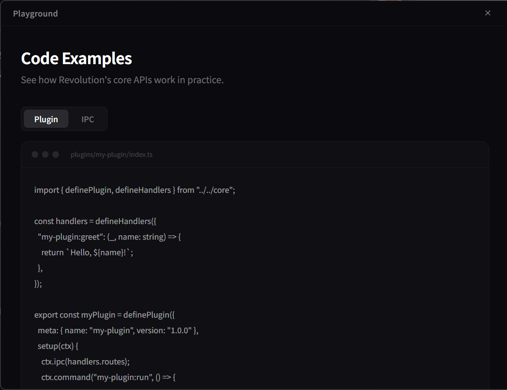
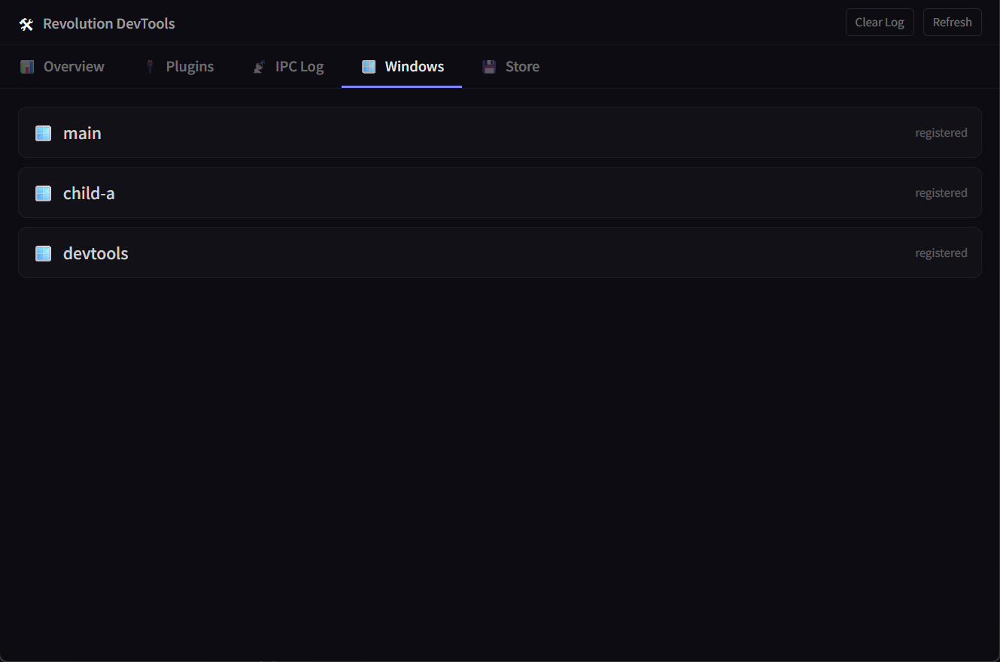

<p align="center">
  <h1 align="center">⚡ Electron X-Elevolution</h1>
  <p align="center">A purely functional, plugin-based Electron framework with type-safe IPC and zero boilerplate.</p>
</p>

<p align="center">
  <a href="./README.md">English</a> |
  <a href="./docs/readme/docs/README.zh-CN.md">简体中文</a> |
  <a href="./docs/readme/docs/README.zh-TW.md">繁體中文</a> |
  <a href="./docs/readme/docs/README.ja.md">日本語</a>
</p>

<p align="center">
  
  
  
  
  
</p>

---

## Why X-Elevolution?

Building Electron apps shouldn't mean wrestling with boilerplate, unsafe IPC channels, or tangled class hierarchies. X-Elevolution was born from real frustration:

| Pain Point | X-Elevolution's Answer |
|---|---|
| IPC channels are stringly-typed and error-prone | **Write handlers once → types auto-generated for renderer** |
| Class-based frameworks are rigid and hard to test | **Purely functional — arrow functions all the way** |
| Adding features means touching 5+ files | **Plugin system — self-contained, hot-reloadable units** |
| Project setup takes hours | **One command → complete runnable project** |
| No visibility into IPC traffic during dev | **Built-in DevTools panel showing IPC calls, plugin state, memory** |

## Quick Start

```bash
npx @x-elevolution/cli create my-app
cd my-app
pnpm install
pnpm dev
```

That's it. You have a running Electron app with React, Vite HMR, type-safe IPC, and a plugin system ready to go.

## Screenshots

| Main Window | Child Window |
|:-----------:|:------------:|
|  |  |

| DevTools - Overview | DevTools - IPC Log |
|:-------------------:|:------------------:|
|  |  |

## Core Concepts

### Type-Safe IPC (Write Once, Types Everywhere)

Define handlers in the main process:

```ts
// main-process/ipc/user.ts
import { defineHandlers, defineListeners } from "@x-elevolution/core";

export const userHandlers = defineHandlers({
  "user:get": (event, id: string) => {
    return { id, name: "Alice", email: "alice@example.com" };
  },
  "user:list": (event, page: number, limit: number) => {
    return { users: [], total: 0 };
  },
});

export const userListeners = defineListeners({
  "user:logout": (event) => {
    console.log("User logged out");
  },
});
```

Register them:

```ts
// main-process/main.ts
import { registerRoutes } from "@x-elevolution/core";
import { userHandlers, userListeners } from "./ipc/user";

registerRoutes(userHandlers.routes);
registerRoutes(userListeners.routes);
```

Generate renderer types:

```bash
pnpm gen:ipc
```

Use in renderer with full type safety:

```ts
// renderer — types are auto-generated!
const user = await ipcInvoke("user:get", "123");
//    ^? { id: string; name: string; email: string }
```

### Plugin System

Plugins are self-contained units that can register IPC routes, windows, commands, and communicate via events:

```ts
import { definePlugin, defineHandlers } from "@x-elevolution/core";

const handlers = defineHandlers({
  "notes:create": (_, title: string, content: string) => {
    return { id: crypto.randomUUID(), title, content };
  },
});

export const notesPlugin = definePlugin({
  meta: {
    name: "notes",
    version: "1.0.0",
    description: "Note-taking plugin",
  },
  setup(ctx) {
    ctx.ipc(handlers.routes);

    ctx.command("notes:clear-all", () => {
      ctx.log.info("All notes cleared");
    });

    ctx.on("app:ready", () => {
      ctx.log.info("Notes plugin ready");
    });

    // Cleanup function (called on uninstall)
    return () => {
      ctx.log.info("Notes plugin deactivated");
    };
  },
});
```

Install plugins in your main process:

```ts
import { installPlugin } from "@x-elevolution/core";
import { notesPlugin } from "./plugins/notes";

await installPlugin(notesPlugin);
```

### Window Management

```ts
import { registerWindows, createWindow, sendToWindow, broadcastToWindows } from "@x-elevolution/core";

// Register window factories
registerWindows({
  main: createMainWindow,
  settings: createSettingsWindow,
});

// Create windows on demand
const mainWin = createWindow("main");
const settingsWin = createWindow("settings");

// Send to specific window
sendToWindow("main", "notification", { message: "Hello!" });

// Broadcast to all windows
broadcastToWindows("theme:changed", "dark");
```

### IPC Middleware & Interceptors

```ts
import { useIpcMiddleware, addIpcInterceptor } from "@x-elevolution/core";

// Middleware — can intercept, modify, or abort calls
useIpcMiddleware((channel, type, args, next) => {
  const start = Date.now();
  const result = next();
  console.log(`[${channel}] took ${Date.now() - start}ms`);
  return result;
});

// Interceptor — lightweight observer (cannot modify)
const remove = addIpcInterceptor((channel, type) => {
  console.log(`IPC called: ${channel} (${type})`);
});

// Later: remove the interceptor
remove();
```

### EventBus (Inter-Plugin Communication)

```ts
import { EventBus } from "@x-elevolution/core";

EventBus.on("user:login", (user) => {
  console.log(`${user.name} logged in`);
});

EventBus.emit("user:login", { name: "Alice" });

EventBus.once("app:first-launch", () => {
  // Runs only once
});
```

## CLI Commands

| Command | Description |
|---|---|
| `x-elevolution create <name>` | Scaffold a complete project |
| `x-elevolution create <name> --local` | Scaffold with local core link (for development) |
| `x-elevolution add window <name>` | Generate window (main factory + renderer page) |
| `x-elevolution add plugin <name>` | Generate plugin scaffold |
| `x-elevolution add ipc <name>` | Generate IPC module with handlers & listeners |
| `x-elevolution gen:ipc` | Auto-generate renderer IPC types from handlers |

## Project Structure (After `create`)

```
my-app/
├── main-process/
│   ├── main.ts                  # Entry point
│   ├── constant/index.ts        # Constants (IS_DEV, paths)
│   ├── ipc/
│   │   ├── index.ts             # IPC registration
│   │   ├── store.ts             # Store handlers
│   │   └── window.ts            # Window handlers
│   ├── plugins/
│   │   ├── devtools/index.ts    # Built-in DevTools plugin
│   │   └── example-plugin/      # Example plugin
│   ├── windows/
│   │   ├── index.ts             # Window registry
│   │   ├── main.ts              # Main window factory
│   │   └── devtools.ts          # DevTools window factory
│   └── utils/
├── renderer-process/
│   ├── shared/
│   │   ├── services/
│   │   │   ├── ipc.ts           # IPC invoke/send helpers
│   │   │   └── ipc.generated.ts # Auto-generated types
│   │   └── styles/index.css     # Tailwind CSS
│   └── windows/
│       ├── main/                # Main window UI
│       └── devtools/            # DevTools panel UI
├── preload/index.ts             # Preload script
├── types/                       # Global type declarations
├── vite.config.ts               # Vite multi-page config
├── tsconfig.json
└── package.json
```

## Extensibility

### Context Extension

Inject custom fields into all plugin contexts:

```ts
import { extendPluginContext } from "@x-elevolution/core";
import Store from "electron-store";
import { dialog } from "electron";

const store = new Store();

extendPluginContext((ctx, meta) => {
  ctx.store = store;
  ctx.dialog = dialog;
});

// Now every plugin has access to ctx.store and ctx.dialog
```

### Custom Logger

Replace the built-in console logger with any implementation:

```ts
import { setLogger } from "@x-elevolution/core";
import log from "electron-log";

setLogger(log);
// All framework and plugin logs now go through electron-log
```

### Plugin Hot-Reload (Dev Mode)

```ts
import { installPluginHot } from "@x-elevolution/core";
import { myPlugin } from "./plugins/my-plugin";

await installPluginHot(
  "./main-process/plugins/my-plugin",
  myPlugin,
  () => require("./plugins/my-plugin").myPlugin,
  process.env.NODE_ENV === "development"
);
// File changes trigger automatic plugin reload
```

### Window Lifecycle Hooks

```ts
import { onWindowCreated, onWindowClosed } from "@x-elevolution/core";

onWindowCreated((name, win) => {
  console.log(`Window "${name}" created`);
  // Inject behavior into all windows
});

onWindowClosed((name, win) => {
  console.log(`Window "${name}" closed`);
});
```

## Tech Stack

| Layer | Technology |
|---|---|
| Runtime | Electron 37 |
| Bundler | Vite 6 |
| UI | React 19 |
| Language | TypeScript 5.9 |
| Styling | Tailwind CSS 4 |
| Linting | Biome |
| Packaging | electron-builder |
| Monorepo | Turborepo + pnpm workspaces |

## Monorepo Structure

```
x-elevolution/
├── packages/
│   ├── core/     → @x-elevolution/core (runtime framework)
│   └── cli/      → @x-elevolution/cli (scaffolding tool)
├── apps/
│   └── electron-app/  → Example app & CLI template
├── docs/              → Documentation
├── turbo.json
├── pnpm-workspace.yaml
└── package.json
```

## Contributing

See [docs/development/guide.md](./docs/development/guide.md) for the contributor guide covering local development, code conventions, and publishing.

## License

[MIT](./LICENSE)
