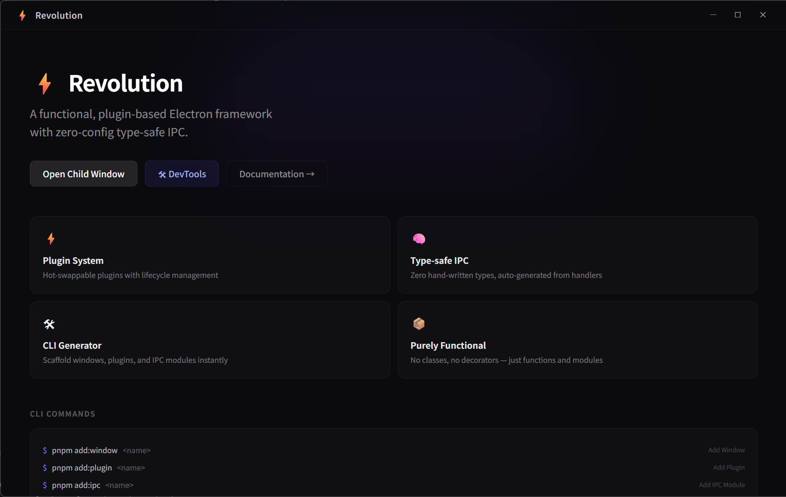
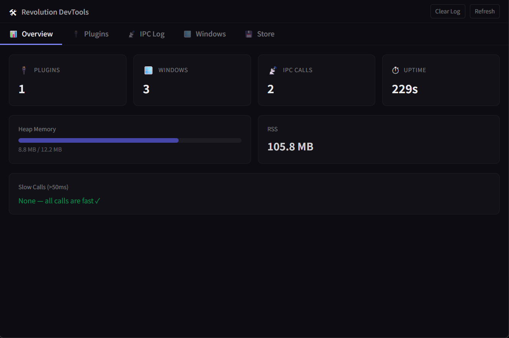

<p align="center">
  <h1 align="center">⚡ Electron Revolution</h1>
  <p align="center">纯函数式、插件化的 Electron 框架，类型安全的 IPC，零样板代码。</p>
</p>

<p align="center">
  <a href="../../README.md">English</a> |
  <a href="./README.zh-CN.md">简体中文</a> |
  <a href="./README.zh-TW.md">繁體中文</a> |
  <a href="./README.ja.md">日本語</a>
</p>

<p align="center">
  
  
  
  
  
</p>

---

## 为什么选择 Revolution？

构建 Electron 应用不应该意味着与样板代码、不安全的 IPC 通道或纠缠的类层次结构作斗争。Revolution 诞生于真实的开发痛点：

| 痛点 | Revolution 的解决方案 |
|---|---|
| IPC 通道是字符串类型，容易出错 | **写一次 handler → 类型自动生成到渲染进程** |
| 基于类的框架僵硬且难以测试 | **纯函数式 — 全程箭头函数** |
| 添加功能需要修改 5+ 个文件 | **插件系统 — 自包含、可热重载的单元** |
| 项目搭建需要数小时 | **一条命令 → 完整可运行项目** |
| 开发时无法观察 IPC 流量 | **内置 DevTools 面板，展示 IPC 调用、插件状态、内存** |

## 快速开始

```bash
npx @revolution/cli create my-app
cd my-app
pnpm install
pnpm dev
```

就这样。你已经拥有一个运行中的 Electron 应用，包含 React、Vite HMR、类型安全的 IPC 和即用的插件系统。



## 核心概念

### 类型安全的 IPC（写一次，类型到处用）

在主进程中定义 handler：

```ts
// main-process/ipc/user.ts
import { defineHandlers, defineListeners } from "@revolution/core";

export const userHandlers = defineHandlers({
  "user:get": (event, id: string) => {
    return { id, name: "Alice", email: "alice@example.com" };
  },
  "user:list": (event, page: number, limit: number) => {
    return { users: [], total: 0 };
  },
});

export const userListeners = defineListeners({
  "user:logout": (event) => {
    console.log("用户已登出");
  },
});
```

注册路由：

```ts
// main-process/main.ts
import { registerRoutes } from "@revolution/core";
import { userHandlers, userListeners } from "./ipc/user";

registerRoutes(userHandlers.routes);
registerRoutes(userListeners.routes);
```

生成渲染进程类型：

```bash
pnpm gen:ipc
```

在渲染进程中使用，享受完整类型安全：

```ts
// renderer — 类型已自动生成！
const user = await ipcInvoke("user:get", "123");
//    ^? { id: string; name: string; email: string }
```

### 插件系统

插件是自包含的单元，可以注册 IPC 路由、窗口、命令，并通过事件通信：

```ts
import { definePlugin, defineHandlers } from "@revolution/core";

const handlers = defineHandlers({
  "notes:create": (_, title: string, content: string) => {
    return { id: crypto.randomUUID(), title, content };
  },
});

export const notesPlugin = definePlugin({
  meta: {
    name: "notes",
    version: "1.0.0",
    description: "笔记插件",
  },
  setup(ctx) {
    ctx.ipc(handlers.routes);

    ctx.command("notes:clear-all", () => {
      ctx.log.info("所有笔记已清除");
    });

    ctx.on("app:ready", () => {
      ctx.log.info("笔记插件就绪");
    });

    // 清理函数（卸载时调用）
    return () => {
      ctx.log.info("笔记插件已停用");
    };
  },
});
```

在主进程中安装插件：

```ts
import { installPlugin } from "@revolution/core";
import { notesPlugin } from "./plugins/notes";

await installPlugin(notesPlugin);
```

### 窗口管理

```ts
import { registerWindows, createWindow, sendToWindow, broadcastToWindows } from "@revolution/core";

// 注册窗口工厂
registerWindows({
  main: createMainWindow,
  settings: createSettingsWindow,
});

// 按需创建窗口
const mainWin = createWindow("main");
const settingsWin = createWindow("settings");

// 向指定窗口发送消息
sendToWindow("main", "notification", { message: "你好！" });

// 向所有窗口广播
broadcastToWindows("theme:changed", "dark");
```


### IPC 中间件与拦截器

```ts
import { useIpcMiddleware, addIpcInterceptor } from "@revolution/core";

// 中间件 — 可以拦截、修改或终止调用
useIpcMiddleware((channel, type, args, next) => {
  const start = Date.now();
  const result = next();
  console.log(`[${channel}] 耗时 ${Date.now() - start}ms`);
  return result;
});

// 拦截器 — 轻量观察者（不能修改调用）
const remove = addIpcInterceptor((channel, type) => {
  console.log(`IPC 调用: ${channel} (${type})`);
});

// 之后移除拦截器
remove();
```

### EventBus（插件间通信）

```ts
import { EventBus } from "@revolution/core";

EventBus.on("user:login", (user) => {
  console.log(`${user.name} 已登录`);
});

EventBus.emit("user:login", { name: "Alice" });

EventBus.once("app:first-launch", () => {
  // 只执行一次
});
```

### 内置 DevTools

框架包含内置的 DevTools 面板，提供对 IPC 调用、插件状态和应用程序内存使用的实时可见性：




## CLI 命令

| 命令 | 描述 |
|---|---|
| `revolution create <name>` | 创建完整项目 |
| `revolution create <name> --local` | 创建项目并链接本地 core（开发用） |
| `revolution add window <name>` | 生成窗口（主进程工厂 + 渲染进程页面） |
| `revolution add plugin <name>` | 生成插件骨架 |
| `revolution add ipc <name>` | 生成 IPC 模块（handlers + listeners） |
| `revolution gen:ipc` | 从 handlers 自动生成渲染进程 IPC 类型 |

## 项目结构（`create` 之后）

````
my-app/
├── main-process/
│   ├── main.ts                  # 入口文件
│   ├── constant/index.ts        # 常量（IS_DEV、路径等）
│   ├── ipc/
│   │   ├── index.ts             # IPC 注册
│   │   ├── store.ts             # Store handlers
│   │   └── window.ts            # Window handlers
│   ├── plugins/
│   │   ├── devtools/index.ts    # 内置 DevTools 插件
│   │   └── example-plugin/      # 示例插件
│   ├── windows/
│   │   ├── index.ts             # 窗口注册表
│   │   ├── main.ts              # 主窗口工厂
│   │   └── devtools.ts          # DevTools 窗口工厂
│   └── utils/
├── renderer-process/
│   ├── shared/
│   │   ├── services/
│   │   │   ├── ipc.ts           # IPC invoke/send 辅助函数
│   │   │   └── ipc.generated.ts # 自动生成的类型
│   │   └── styles/index.css     # Tailwind CSS
│   └── windows/
│       ├── main/                # 主窗口 UI
│       └── devtools/            # DevTools 面板 UI
├── preload/index.ts             # 预加载脚本
├── types/                       # 全局类型声明
├── vite.config.ts               # Vite 多页面配置
├── tsconfig.json
└── package.json
````

## 可扩展性

### Context 扩展

向所有插件的 context 注入自定义字段：

```ts
import { extendPluginContext } from "@revolution/core";
import Store from "electron-store";
import { dialog } from "electron";

const store = new Store();

extendPluginContext((ctx, meta) => {
  ctx.store = store;
  ctx.dialog = dialog;
});

// 现在每个插件都可以访问 ctx.store 和 ctx.dialog
```

### 自定义 Logger

用任意实现替换内置的 console logger：

```ts
import { setLogger } from "@revolution/core";
import log from "electron-log";

setLogger(log);
// 所有框架和插件日志现在通过 electron-log 输出
```

### 插件热重载（开发模式）

```ts
import { installPluginHot } from "@revolution/core";
import { myPlugin } from "./plugins/my-plugin";

await installPluginHot(
  "./main-process/plugins/my-plugin",
  myPlugin,
  () => require("./plugins/my-plugin").myPlugin,
  process.env.NODE_ENV === "development"
);
// 文件变化自动触发插件重载
```

### 窗口生命周期钩子

```ts
import { onWindowCreated, onWindowClosed } from "@revolution/core";

onWindowCreated((name, win) => {
  console.log(`窗口 "${name}" 已创建`);
  // 向所有窗口注入行为
});

onWindowClosed((name, win) => {
  console.log(`窗口 "${name}" 已关闭`);
});
```

## 技术栈

| 层级 | 技术 |
|---|---|
| 运行时 | Electron 37 |
| 构建工具 | Vite 6 |
| UI 框架 | React 19 |
| 语言 | TypeScript 5.9 |
| 样式 | Tailwind CSS 4 |
| 代码检查 | Biome |
| 打包 | electron-builder |
| Monorepo | Turborepo + pnpm workspaces |

## Monorepo 结构

````
electron-revolution/
├── packages/
│   ├── core/     → @revolution/core（运行时框架）
│   └── cli/      → @revolution/cli（脚手架工具）
├── apps/
│   └── electron-app/  → 示例应用 & CLI 模板
├── docs/              → 文档
├── turbo.json
├── pnpm-workspace.yaml
└── package.json
````


## 许可证

[MIT](./LICENSE)